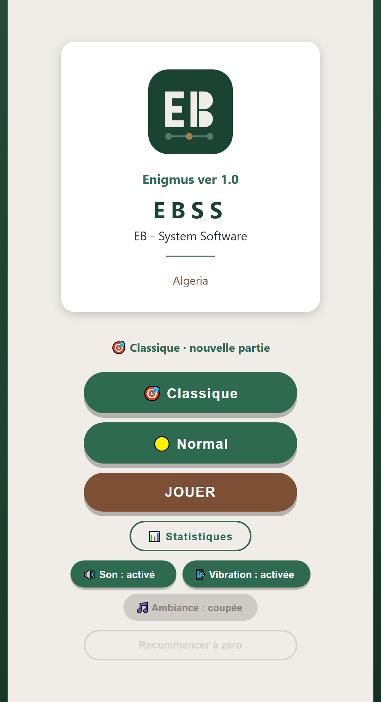
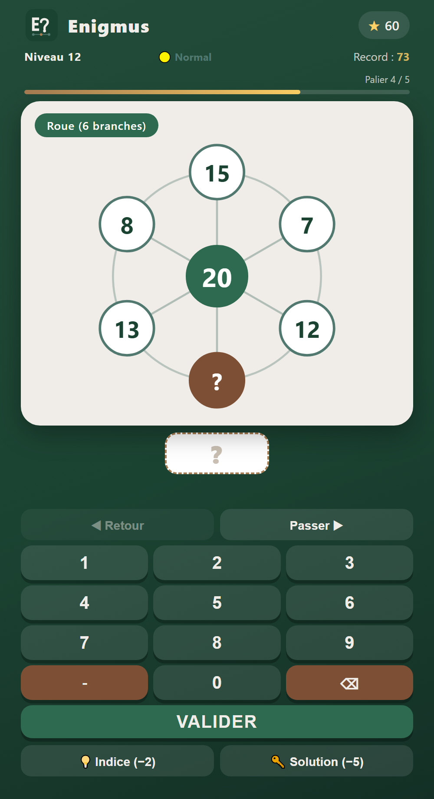
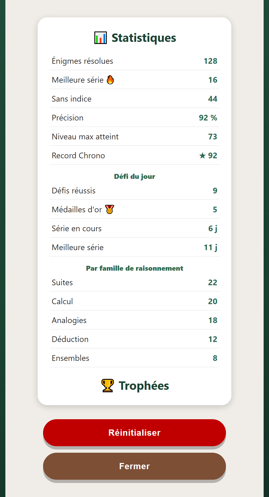

# 🧩 Enigmus

**Casse-têtes de logique et de mathématiques à l'infini** — un jeu du studio **EBSS** (EB · System Software), Algérie.

## ▶️ Jouer maintenant

### 👉 **[Lancer Enigmus](https://ellies09.github.io/enigmus/)**

Jouable directement dans le navigateur (ordinateur, mobile, tablette) — et **installable** comme une véritable application, qui fonctionne ensuite **hors-ligne**.

**Android** : tu peux aussi télécharger l'application → 📥 **[Télécharger l'APK](https://github.com/ellies09/enigmus/releases/latest)** *(installe-la en autorisant les « sources inconnues », avec mot de passe date du jour « AAAAMMJJ »)*.

**Aussi sur itch.io** : joue en ligne, ou télécharge les versions **Android** et **Windows** → 🎮 **[Enigmus sur itch.io](https://ellies09.itch.io/enigmus)**.

## 📱 Installer sur ton téléphone

- **iPhone / iPad** : ouvre le lien dans **Safari** → **Partager** → **Sur l'écran d'accueil**.
- **Android** : ouvre le lien dans **Chrome** → menu **⋮** → **Ajouter à l'écran d'accueil**.

## 📸 Aperçu

  
  &nbsp;&nbsp;
  
  &nbsp;&nbsp;
  

## ✨ Le jeu

- **Niveaux illimités**, générés à l'infini — plus de 70 familles de raisonnement : suites logiques, analogies (triangles, carrés, croix…), grilles magiques, roues, camemberts, matrices de figures, calcul croisé, et bien d'autres.
- **3 modes de jeu** : 🎯 Classique · 🌿 Zen · ⏱️ Chrono.
- **Défi du jour**, trophées à débloquer, statistiques détaillées et séries (combos).
- **3 niveaux de difficulté** : Facile · Normal · Difficile.
- Réglages : son, vibration et musique d'ambiance.

## ℹ️ À propos

Enigmus est édité sous la marque **EBSS — EB System Software** (Algérie).
Application web autonome (PWA), **sans publicité** et **sans collecte de données**.

© EBSS
